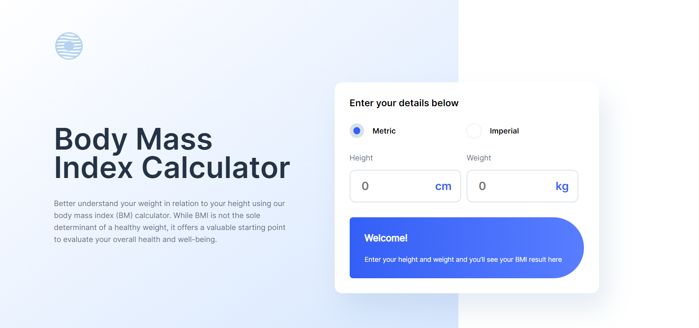
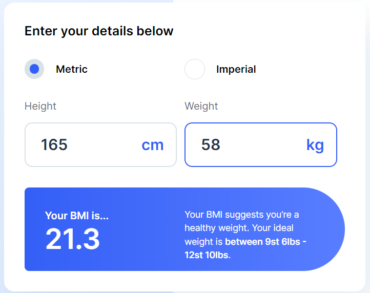
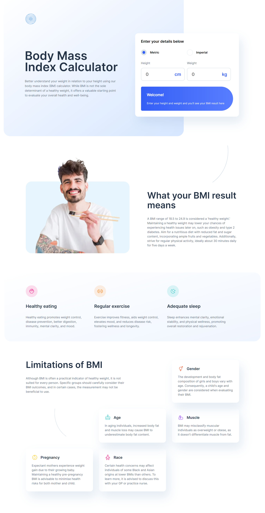
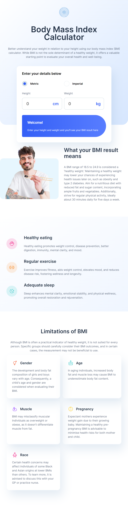

# Frontend Mentor - Body Mass Index Calculator

## Welcome! 👋

This is a solution to the [Body Mass Index Calculator challenge on Frontend Mentor](https://www.frontendmentor.io/challenges/body-mass-index-calculator-brrBkfSz1T). Frontend Mentor challenges help you improve your coding skills by building realistic projects. 

## Table of contents

- [Frontend Mentor - Body Mass Index Calculator](#frontend-mentor---body-mass-index-calculator)
  - [Welcome! 👋](#welcome-)
  - [Table of contents](#table-of-contents)
  - [Overview](#overview)
    - [The challenge](#the-challenge)
    - [Screenshot](#screenshot)
      - [1. BMI Calculator](#1-bmi-calculator)
      - [2. Laptop Preview](#2-laptop-preview)
      - [3. Tablet Preview](#3-tablet-preview)
    - [Links](#links)
  - [My process](#my-process)
    - [Built with](#built-with)
  - [Author](#author)
  - [Contributing](#contributing)
  - [Show Your Support](#show-your-support)

## Overview

### The challenge

Users should be able to:

- Select whether they want to use metric or imperial units
- Enter their height and weight
- See their BMI result, with their weight classification and healthy weight range
- View the optimal layout for the interface depending on their device's screen size
- See hover and focus states for all interactive elements on the page

### Screenshot
#### 1. BMI Calculator

#### 2. Laptop Preview

#### 3. Tablet Preview

### Links

- Solution URL: [here](https://github.com/Slimani-CE/front-end-mentor-ch14)
- Live Site URL: [here](https://slimani-ce.github.io/front-end-mentor-ch14)

## My process

### Built with

- Semantic HTML5 markup
- CSS custom properties
- Flexbox
- CSS Grid
- Laptop-first workflow

## Author

- Website - [here](https://slimani-ce.github.io/)
- Frontend Mentor - [@Slimani-CE](https://www.frontendmentor.io/profile/Slimani-CE)
- Twitter - [@mstapha4real](https://twitter.com/mstapha4real)

## Contributing
Contributions are always welcome! If you find any issues with the code or have suggestions for improvements, please feel free to submit a pull request.

Just remember, we are not responsible for any broken keyboards or late-night coding sessions that may result from your contributions! 😄

## Show Your Support
If you found this notebook helpful, please give it a ⭐️ to show your support!